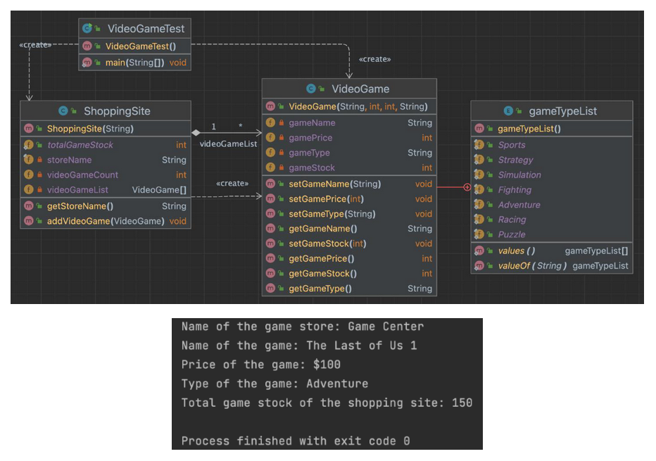
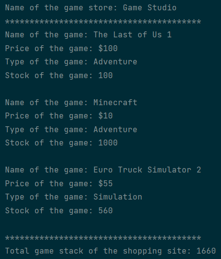

# 🏫 University Assignment OOP Course

---

`a)` Create a class named VideoGame. The VideoGame class should contain the following variables:

- gameName
- gamePrice
- gameStock
- gameType
- gameTypeList\* (Note: gameTypeList should be defined as an enum according to the given UML diagram)

`b)` The variables should be defined appropriately.

`c)` Set and get methods should be defined for the variables.

`d)` A constructor method should be defined according to the class.

`e)` Create a class named ShoppingSite. Add an Array named videoGameList to this class. Write a method named addVideoGame for adding a video game to the ShoppingSite.

`f)` The ShoppingSite class should contain the following variables:

- storeName
- videoGameCount
- totalGameStock

`g)` Pay attention to the usage of static and composition concepts.

`h)` Create a class named VideoGameTest. Add at least 2 video games to test the totalGameStock variable. Perform the operations based on the given output.

---

✅ My screen output.

